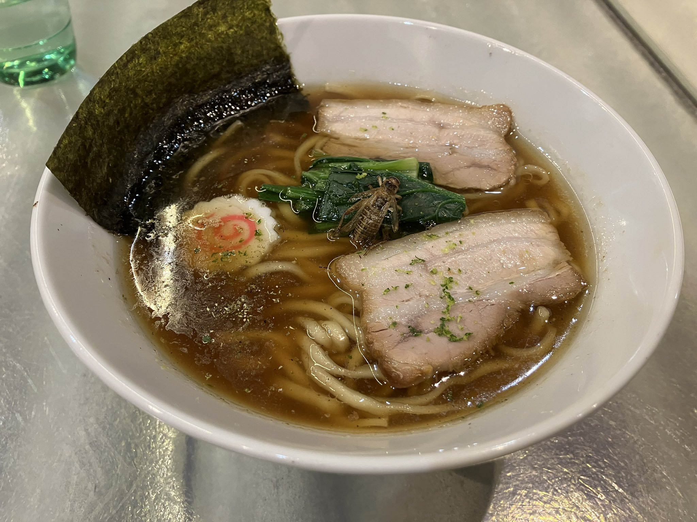
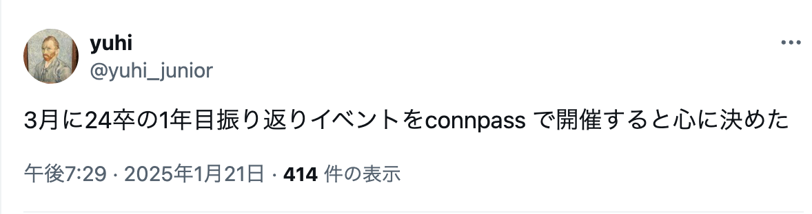
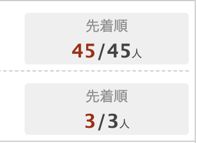
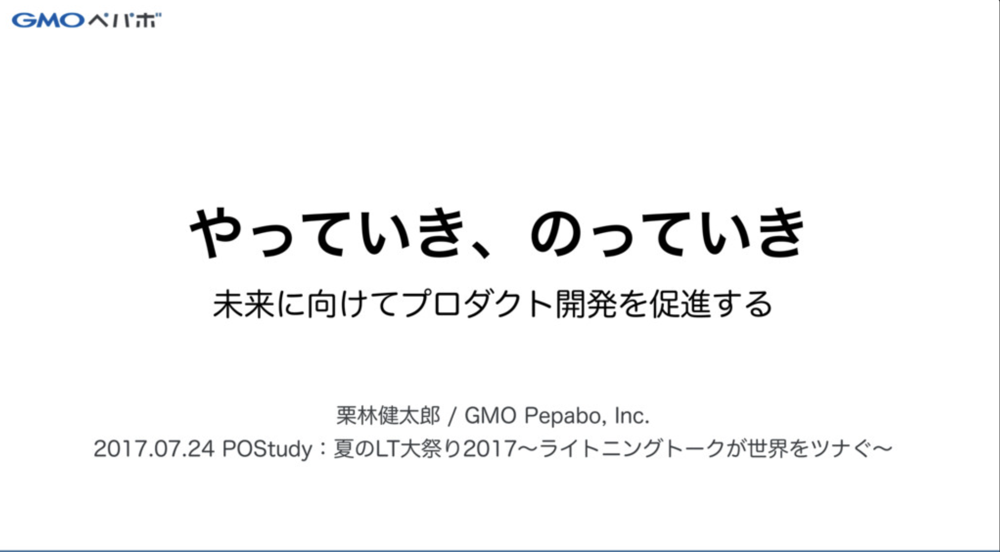

# 24卒コミュニティ
# "やっていく"よ

2025年3月25日
24th Engineers Community
yuhi

---

# 自己紹介

- 名前: yuhi (@yuhi_junior)
- 所属: 株式会社プレックス 24卒
- 業務: Ruby on Rails書いてます
- 趣味: 変わった食べ物を食すこと

   

---

# 今日はお集まりいただき
# ありがとうございます

---

# このイベントは
# "やっていき"のノリで始まりました

---

# たくさんの
# "のっていき"に感謝

---

# こちらの資料を読んだことがある方🖐️

---

# 固い定義
### やっていき：
リーダーシップ。ビジョンを示すこと。

### のっていき：
フォロワーシップ。ビジョンを実現すること。

<!--
class: slide
footer: 参考：「やっていき、のっていき」 https://speakerdeck.com/kentaro/the-secret-of-leadership-and-followership
 -->
---
# 柔らかい定義
### やっていき、のっていき、ドーン！

<iframe width="900" height="400" src="https://www.youtube.com/embed/qdwO1l5nKyg?si=3Xjxve2RnLF8wjtf" title="YouTube video player" frameborder="0" allow="accelerometer; autoplay; clipboard-write; encrypted-media; gyroscope; picture-in-picture; web-share" referrerpolicy="strict-origin-when-cross-origin" allowfullscreen></iframe>

<!--
class: slide
footer: 参考：デレク・シヴァーズ 「社会運動はどうやって起こすか」 https://youtu.be/qdwO1l5nKyg?feature=shared
 -->

---

# ドーンしていきましょう🕺

<!--
class: slide
footer: ""
 -->

---

# 今日の内容

### 1年目の振り返りと題した自慢大会です
### どんなことでも大きな拍手を送ってください👏

---

# タイムテーブル

- 19:10 ~	あいさつ
- 19:15 ~	自己紹介
- 19:25 ~	なんでもシェア会
- 20:25 ~	LT会
- 21:05 ~	フリー交流タイム・懇親会
- 21:30 ~	終了・解散

---

## 参考文献
- 「やっていき、のっていき」 https://speakerdeck.com/kentaro/the-secret-of-leadership-and-followership
- デレク・シヴァーズ 「社会運動はどうやって起こすか」 https://youtu.be/qdwO1l5nKyg?feature=shared
