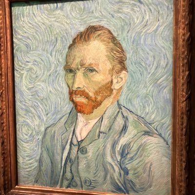
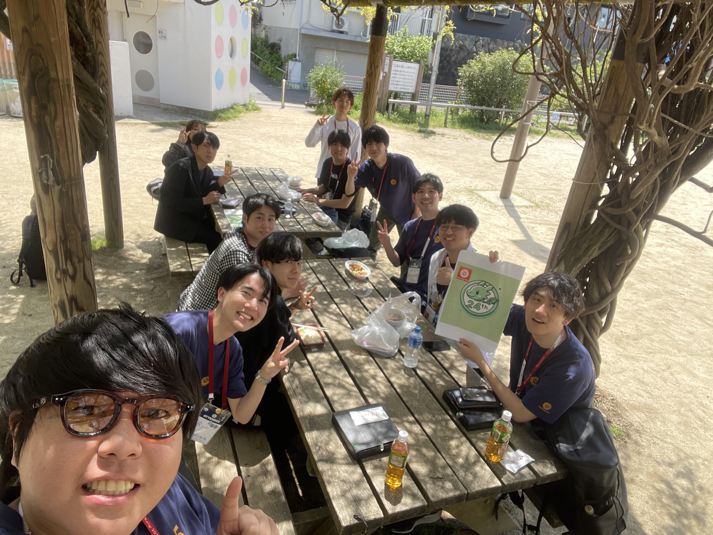

# 第二回　24th Dev

2025年5月20日

---

# コミュニティ名 「24th Dev」

- 読み方: にーよんでぶ
- ハッシュタグ: #24th_dev
  - Xで拡散お願いします🙏
  - （会場・飲食スポンサーがつきやすくなります）

---
# 会場案内(あれば)
---

# 自己紹介

---

# 司会進行

- 名前: ガレバレ(ぱんち) (@garebare521)
- 所属: 秘密(会社に許可取れてない)24卒
- 業務: Ruby on Rails / Next.js
- 趣味: カフェ巡り・ごはん

---
# 主催

- 名前: yuhi (@yuhi_junior)
- 所属: 株式会社プレックス 24卒
- 業務: Ruby on Rails / React
- 趣味: 変わった食べ物を食すこと

---

# 今日の内容

### 2年目挑戦したいこと共有会！　
### お互いの挑戦をリスペクトしよう👏

---

# タイムテーブル
| 時間 | 内容 |
|:---|:---|
| 18:50 ~ | 受付・グループ分け |
| 19:00 ~ | あいさつ |
| 19:05 ~ | グループ内で自己紹介 |
| 19:15 ~ | なんでもシェア会（途中グループ替えの可能性あり） |
| 20:00 ~ | LT会 |
| 20:20 ~ | フリー交流タイム・懇親会 |
| 21:30 | 終了・解散 |

---
# お知らせ
### ２つあります。

---

# 技術別チャンネル

### 背景・目的（理想編）
  - RubyKaigiランチ会盛り上がった
  - 全体イベント<->技術別イベントで相互的に盛り上がったら理想的
    - 「繋がりを作り・継続する」
        のサイクル🔥

---

# 技術別チャンネル

### 背景・目的（現実編）
- とはいえ、複数技術のイベントを開催できるほどの人的リソースが運営にない😢
- なので、最初はDiscordのチャンネルで盛り上がりましょう🔥

---

# 技術別チャンネル

### やれたら良いこと
  - 一旦はRubyとTSとGo（増やしても全然オッケー）
  - 知見交換、イベント参加報告、勉強会など
  - やっていき・のっていきを起こしていただけると🙏

---

# ハッカソン
### 興味ある方いらっしゃればアンケートにお願いします

---

# アンケート

---

# 懇親会

