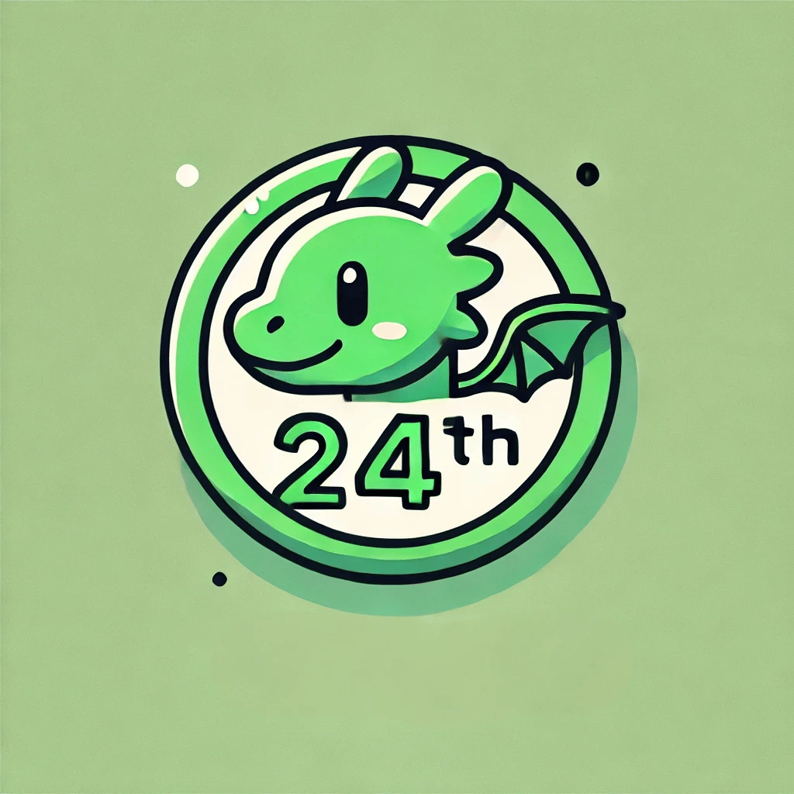
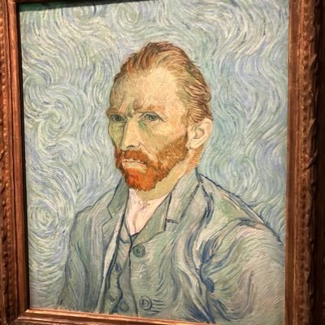

<!-- TODO: タイトルの書き換え -->
# 第x回　24th Dev

<!-- TODO: 日付の書き換え -->
20xx年xx月xx日

---

# 自己紹介

<!--TODO: 司会者の内容に書き換え -->

- 名前: yuhi (@yuhi_junior)
- 所属: 株式会社プレックス 24卒
- 業務: Ruby on Rails / React
- 趣味: 変わった食べ物を食すこと

---

# 今日の内容

<!-- TODO: 当日の内容に応じて書き換え -->

### 1年目の振り返りと題した自慢大会です
### どんなことでも大きな拍手を送ってください👏

---

# タイムテーブル

<!-- TODO: タイムテーブルの書き換え -->

| 時間 | 内容 |
|:---|:---|
| 18:50 ~ | 受付・グループ分け |
| 19:00 ~ | あいさつ |
| 19:05 ~ | グループ内で自己紹介 |
| 19:15 ~ | なんでもシェア会（途中グループ替えの可能性あり） |
| 20:00 ~ | LT会 |
| 20:20 ~ | フリー交流タイム・懇親会 |
| 21:30 | 終了・解散 |

---

# アンケート

<!-- TODO: アンケートのQR貼り付け -->

---

# 懇親会

<!-- TODO: 終了時間を記入 -->

