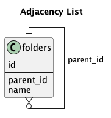
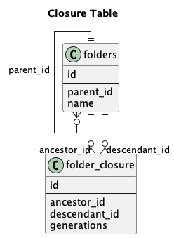

# 階層構造を表現するデータ構造とリファクタリング
## 〜1年で10倍成長したプロダクトの変化と課題〜

2025年6月26日
yuhi (@yuhi_junior)
Wakate.rb #1

---

# 自己紹介


- 名前: yuhi (@yuhi_junior)
- 所属: 株式会社プレックス 24卒
- 業務: Ruby on Rails / React

---

# 階層化機能とは？

### フォルダのようなツリー構造を管理する機能
- フォルダの中にフォルダ・ファイルを作成
- フォルダを削除
- フォルダを別のフォルダの直下へ移動
- パンくずリスト表示
- フォルダ内の全てのファイルを取得

---

# サクミルでの階層化機能

### 2つの階層化機能を実装
1. **フォルダ階層化** - ドキュメント管理
   - リードヘビー
   - 階層の深さ制限なし

2. **見積書階層化** - 工事項目管理
   - ライトヘビー  
   - 階層の深さ3階層まで

---

## 当時のプロダクト状況



### リリース間もない状況 (1年前)
- ユーザー数が少ない
- サービス全体の機能も不十分
- 開発リソース不足
- 新卒1年目が実装担当（社会人初タスク！）

### 意思決定
**パフォーマンス < バグなく最速リリース**
→ **Adjacency List（隣接リスト）を採用**

---

# Adjacency Listの実装

```ruby
class Folder < ApplicationRecord
  has_many :child_folders, class_name: "Folder", 
           inverse_of: 'parent_folder', dependent: :destroy
  belongs_to :parent_folder, class_name: "Folder", 
             foreign_key: 'parent_id', optional: true

  # 祖先ノードを全て取得
  def ancestors
    return [] if parent_id.blank?
    parent_folder.ancestors + [parent_folder]
  end

  # 子孫ノードを全て取得  
  def descendants
    child_folders + child_folders.map(&:descendants).flatten
  end
end
```

---

# プロダクトの成長

### 1年で驚異的な成長！
- **導入社数が10倍以上に成長**
- 1,000社突破
- データ量の大幅増加

### 結果として...
**パフォーマンス面の課題が顕在化**

---

# Adjacency Listの課題

### N+1問題が発生
```ruby
# descendants実行時のログ（6ノードで7回のSQL発行）
Folder Load (0.0ms) SELECT "folders".* FROM "folders" WHERE "folders"."parent_id" = ?
Folder Load (0.0ms) SELECT "folders".* FROM "folders" WHERE "folders"."parent_id" = ?
Folder Load (0.0ms) SELECT "folders".* FROM "folders" WHERE "folders"."parent_id" = ?
...
```

### 問題点
- 祖先・子孫取得が低速
- ツリーのノード数分のSQL発行
- ネットワーク往復のオーバーヘッド増大

---

## フォルダのリファクタリング

### Closure Table（閉包テーブル）を採用



**特徴:**
- 全てのパスの始点と終点を記録
- 読み取りが高速（SQL1回で完了）
- 書き込みは複数SQL必要

**理由:**
フォルダはリードヘビー → 読み取り最適化を優先

---

# Closure Tableの実装

```ruby
class Folder < ActiveRecord::Base
  has_closure_tree dependent: :destroy
end

# ancestors実行時のログ
folder_2_4.ancestors を実行中...
Folder Load (0.0ms) SELECT "folders".* FROM "folders" 
INNER JOIN "folder_hierarchies" ON "folders"."id" = "folder_hierarchies"."ancestor_id" 
WHERE "folder_hierarchies"."descendant_id" = ? 
ORDER BY "folder_hierarchies".generations ASC
```

### 結果: **SQL1回で祖先・子孫を取得可能**

---

# 見積書のリファクタリング

### Adjacency List + 再帰CTEを採用

**理由:**
- ライトヘビー（書き込み優先）
- 階層制限あり（3階層まで）
- Adjacency Listのまま高速化可能

### Rails 7の機能を活用
`ActiveRecord::QueryMethods#with_recursive`

---

# 再帰CTEの実装

```ruby
class Construction < ActiveRecord::Base
  # 祖先ノードを全て取得
  def ancestors
    return [] if parent_id.blank?
    
    Construction.with_recursive(
      ancestors: [
        Construction.where(id: parent_id),
        Construction.joins('JOIN ancestors ON constructions.id = ancestors.parent_id')
      ]
    ).from('ancestors')
  end
end
```

### 結果: **再帰クエリで効率的に階層取得**

---

# まとめ

### 成長フェーズに応じた技術選定の重要性

| 機能 | ワークロード | 制約 | 採用技術 |
|------|------------|------|----------|
| フォルダ | リードヘビー | 制限なし | Closure Table |
| 見積書 | ライトヘビー | 3階層まで | Adjacency List + 再帰CTE |

### 学び
- **要件に応じたデータ構造選択**
- **プロダクト成長を見据えたリファクタリング**
- **パフォーマンスとコストのトレードオフ**

---

# ご清聴ありがとうございました！

---

# 参考文献

- [closure_tree gem](https://github.com/ClosureTree/closure_tree)
- [Rails with_recursive](https://api.rubyonrails.org/classes/ActiveRecord/QueryMethods.html#method-i-with_recursive)