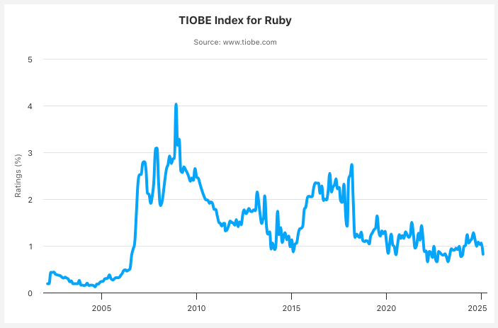

# Wakate.rb #1

2025年6月26日
yuhi

---

# Wifi
### ネットワーク: raksul-guest
### パスワード: 20090901

---

# 自己紹介

- 名前: yuhi (@yuhi_junior)
- 所属: 株式会社プレックス 24卒
- 業務: Ruby on Rails書いてます
- 個人的流行りメソッド: `tally`, `reverse_merge`, `fetch`

---

# Wkate.rbとは？

---
# Wkate.rbとは？

### 若手のRubyist同士が繋がり、
### Rubyを盛り上げるためのコミュニティ

---

# Rubyの盛り上がり

---

## Rubyの盛り上がり

### RubyKaigiの異常な盛り上がり
- 1,500人のRubyistが集結
- 文化祭みたいな雰囲気
- ちゃんと勉強もできる
- 夜通し飲む場所に困らない

---
## Rubyの盛り上がり

### 地域Ruby会議&地域rbも盛り上がっている

  
---

## Rubyの盛り上がり

### 言語開発も進んでいる
- YJIT
- Ractor
- RBS / Sorbet
- etc...

---

# しかし、、、

---

# Rubyを取り巻く現状は甘くない

---

## Rubyの検索数は下降トレンド

<!-- 
class: slide
footer: 参考：TIOBE INDEX 「The Ruby Programming Language」 https://www.tiobe.com/tiobe-index/ruby/
 -->

---

## Matzのコメント
> **2010年ぐらいからRubyの人気が実態を超えていた**ところがあったと思います。そう考えると、今はハイプ曲線で言う「幻滅」から「安定」に来ている時期なんだと思います。つまり、**実態に見合った人気のレベルに落ち着いてきた**というのが僕の認識です。

<!--
class: slide
footer: 参考：ZOZO DEVELOPERS BLOG 「Matzミーティングに潜入！Ruby開発者・まつもとゆきひろさんに聞くRuby秘話」 https://technote.zozo.com/n/n7332024ba61c?sub_rt=share_b
 -->

---

# 一方で
# 若年齢Rubyist人口は減少している

<!--
class: slide
footer: ""
 -->

---

## Rubyistの年齢の分布

<!--
class: slide
footer: 参考：JETBRAINS「Developer Ecosystem Ruby」 https://www.jetbrains.com/lp/devecosystem-2023/ruby/
 -->

---

## 学生からの人気度

<!--
class: slide
footer: 参考：サポーターズ 「新卒プログラミング言語人気ランキングに見るトレンド傾向」https://biz.supporterz.jp/method/003
 -->

---

# Rubyを取り巻く現状をまとめると

<!--
class: slide
footer: ""
 -->

---

# 人気の下降トレンド →
# 
# 
# 
---

# 人気の下降トレンド →
# 若年層の流入減少 →
# 
# 
---

# 人気の下降トレンド →
# 若年層の流入減少 →
# 2010年頃との盛り上がりのギャップ →
# 
---

# 人気の下降トレンド →
# 若年層の流入減少 →
# 2010年頃との盛り上がりのギャップ →
# Rubyイベントの担い手不足？？？

---

# そんなRubyの現状をどうにかしたい

---

# いつまでもRubyKaigiに酔いしれたい

---

# Wkate.rbとは？（再掲）

### 若手のRubyist同士が繋がり、
### Rubyを盛り上げるためのコミュニティ

---

# 今日の内容

### Hello, Rubyist!
### 若手Rubyistでワイワイしましょう！

---

# タイムテーブル

| 時間     | 内容                         | 
| -------- | ---------------------------- | 
| 18:30 ~  | 受付             |
| 19:00 ~  | あいさつ                  | 
| 19:15 ~  | 自己紹介                     | 
| 19:25 ~  | 最近学んだことの報告・シェア | 
| 20:05 ~  | LT 会                         | 
| 20:35 ~  | 懇親会               | 
| 21:30 ~  | 片付け、撤収                 | 
| 22:00    | 完全撤収                     |

---

## 参考文献
- https://scrapbox.io/ruby-jp/%E5%9C%B0%E5%9F%9F.rb
- https://regional.rubykaigi.org/
- https://www.tiobe.com/tiobe-index/ruby/
- https://technote.zozo.com/n/n7332024ba61c?sub_rt=share_b
- https://biz.supporterz.jp/method/003
