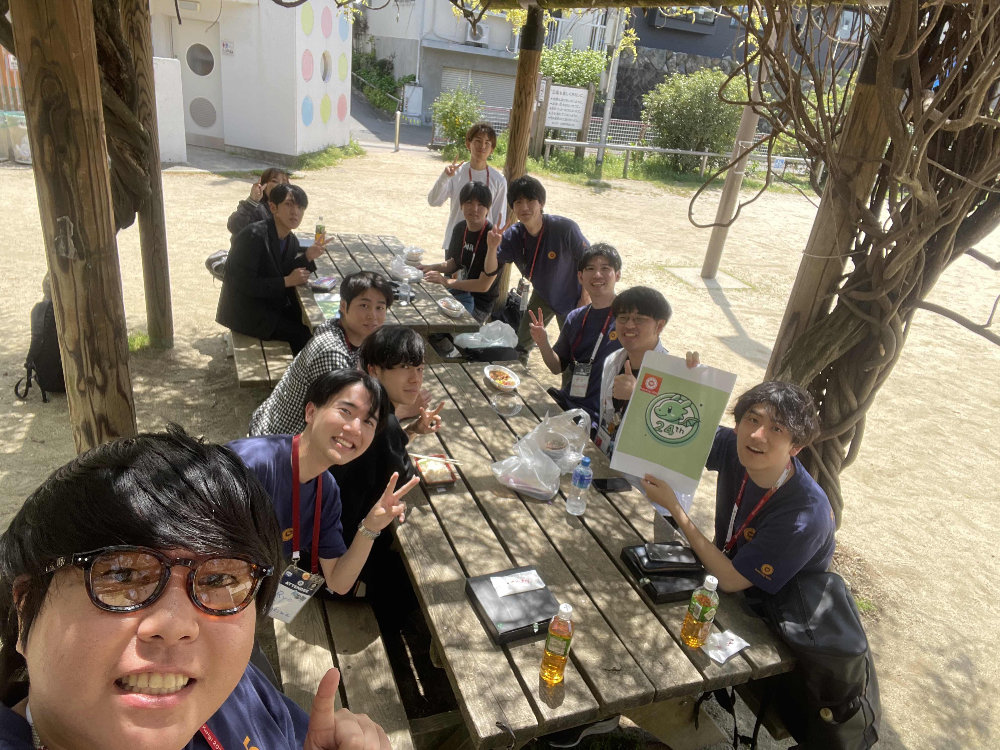
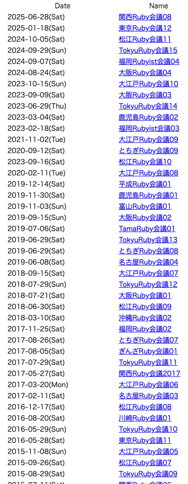
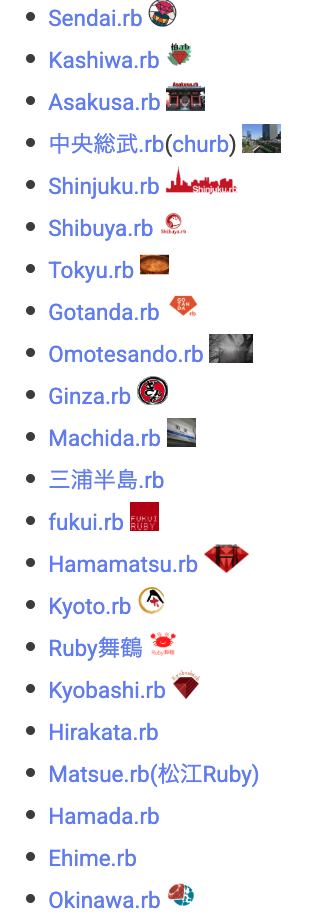
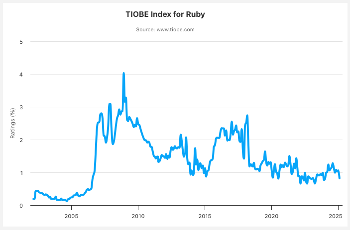
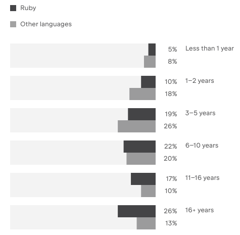
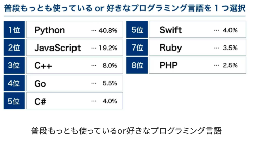

# Wakate.rb #2

2025年10月29日

---

# Wifi
### ネットワーク: 
### パスワード: 

---
# ハッシュタグ

### #wakate_rb

---

# 自己紹介

- 名前: yuhi (@yuhi_junior)
- 所属: 株式会社プレックス 24卒
- 業務: Ruby on Rails
- 人生の岐路に立っている...

---

# Wakate.rbとは？

---
# Wakate.rbとは？

### 若手のRubyist同士が繋がり、
### Rubyを盛り上げるためのコミュニティ

---

# Rubyの盛り上がり

---

## Rubyの盛り上がり

### RubyKaigiの異常な盛り上がり
- 1,500人のRubyistが集結
- 文化祭みたいな雰囲気
- ちゃんと勉強もできる
- 夜通し飲む場所に困らない

---
## Rubyの盛り上がり

### 地域Ruby会議&地域rbも盛り上がっている

  
---

## Rubyの盛り上がり

### 言語開発も進んでいる
- YJIT
- Ractor
- RBS / Sorbet
- etc...

---

# しかし、、、

---

# Rubyを取り巻く現状は甘くない

---

## 検索数の下降トレンド

2010年ごろをピークに、その後は下降トレンド

<!-- 
class: slide
footer: 参考：TIOBE INDEX 「The Ruby Programming Language」 https://www.tiobe.com/tiobe-index/ruby/
 -->

---

## Matzのコメント
> **2010年ぐらいからRubyの人気が実態を超えていた**ところがあったと思います。そう考えると、今はハイプ曲線で言う「幻滅」から「安定」に来ている時期なんだと思います。つまり、**実態に見合った人気のレベルに落ち着いてきた**というのが僕の認識です。

<!--
class: slide
footer: 参考：ZOZO DEVELOPERS BLOG 「Matzミーティングに潜入！Ruby開発者・まつもとゆきひろさんに聞くRuby秘話」 https://technote.zozo.com/n/n7332024ba61c?sub_rt=share_b
 -->

---

# 一方で
# 若年齢Rubyist人口は減少している

<!--
class: slide
footer: ""
 -->

---

## Rubyistの年齢の分布

<!--
class: slide
footer: 参考：JETBRAINS「Developer Ecosystem Ruby」 https://www.jetbrains.com/lp/devecosystem-2023/ruby/
 -->

---

## 学生からの人気度

<!--
class: slide
footer: 参考：サポーターズ 「新卒プログラミング言語人気ランキングに見るトレンド傾向」https://biz.supporterz.jp/method/003
 -->

---

# Rubyを取り巻く現状をまとめると

<!--
class: slide
footer: ""
 -->

---

# 人気の下降トレンド →
# 
# 
---

# 人気の下降トレンド →
# 若年層の流入減少 →
# 
---

# 人気の下降トレンド →
# 若年層の流入減少 →
# 
---

# 人気の下降トレンド →
# 若年層の流入減少 →
# Rubyイベントの担い手不足？？？

---

# そんなRubyの現状をどうにかしたい

---

# いつまでもRubyKaigiに酔いしれたい

---

# Wakate.rbとは？（再掲）

### 若手のRubyist同士が繋がり、
### Rubyを盛り上げるためのコミュニティ

---

# 今日の内容

### ショートトーク会
### 若手Rubyistでワイワイしましょう！

---

# タイムテーブル

| 時間     | 内容                         | 
| -------- | ---------------------------- | 
| 18:30 ~  | 受付             |
| 19:00 ~  | あいさつ                  | 
| 19:15 ~  | ショートトーク（1人10分程度）          | 
| 20:05 ~  | 片付け、撤収                       | 

---

# 懇親会

イベント終了後、懇親会を開催します。

会計については割り勘とさせていただくのであらかじめご了承ください。

---

## 参考文献
- https://scrapbox.io/ruby-jp/%E5%9C%B0%E5%9F%9F.rb
- https://regional.rubykaigi.org/
- https://www.tiobe.com/tiobe-index/ruby/
- https://technote.zozo.com/n/n7332024ba61c?sub_rt=share_b
- https://biz.supporterz.jp/method/003
