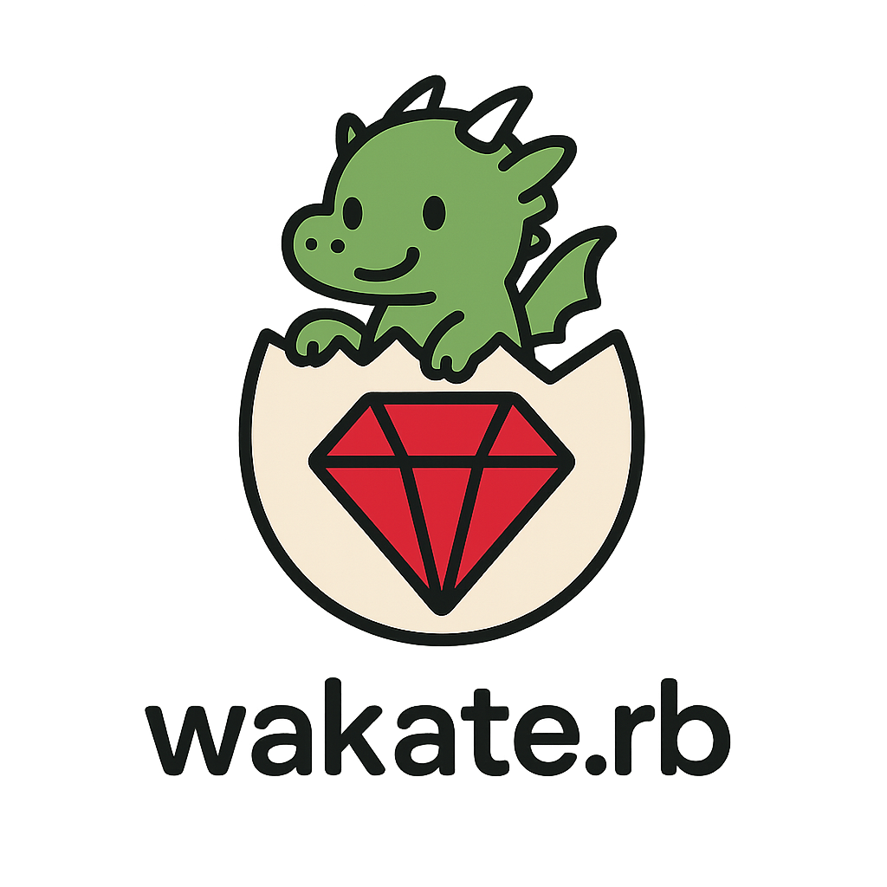
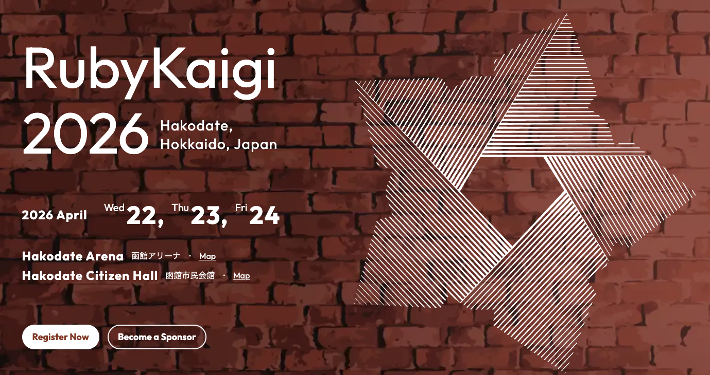

# Wakate.rb #3

2026年2月3日

---

# Wifi
### ネットワーク: 
### パスワード: 

---
# ハッシュタグ

### #wakate_rb

---

# 自己紹介

- 名前: yuhi (@yuhi_junior)
- 所属: プレックス 24卒 → スマートバンク(3月~)
- 業務: Ruby on Rails
- 最近はポーカーにはまっています

---

# Wakate.rbとは？

---
# Wakate.rbとは？

### 若手のRubyist同士が繋がり、
### Rubyを盛り上げるためのコミュニティ

---

# 今回のテーマ

### RubyKaigi 2026に向けた勉強会キックオフ

---

# RubyKaigi 2026

### 4月22〜24日 開催
### 年に一度のRubyコミュニティの祭典

---

# RubyKaigi、正直むずくない？

---

## RubyKaigiが難しく感じられる理由

- 普段の業務では使わないトピックが多い
- 前提知識が暗黙的で、話の文脈を追うのが難しい
- 初参加だと何をどこまで理解すればいいのかが分からない

---

# RubyKaigiとの付き合い方

---

## チーフオーガナイザー @a_matsuda さんの言葉

> RubyKaigiは「勉強会」ではない
> - 勉強しに来ないでいいです
> - 個別のトークを理解することを目的にしない方がいいです
> - たぶん絶望するので

---

## チーフオーガナイザー @a_matsuda さんの言葉

> 本物のプログラマーたちのすっごいカッコいい姿が見れる
> 自分が普段使っている道具が、こういう人たちがこういうことを考えて作ってるんだ！みたいなのがわかるようになる

---

## STORES CTO @ffu_ さんの言葉

> わからなくていいのだろうかっていう引け目を感じることは一切必要なくて、こんなにわからないことがわかったみたいな、わからないジャンルを知ること自体がもはや成果だと思います。

---

# RubyKaigiの楽しみ方

- RubyKaigiは勉強会ではなく、興味を見つける場所
- 登壇者やコミッターの方達に触れて、Rubyへの愛着を深める場所
- 年に一度のRubyコミュニティのお祭り
- 「未知の未知」を「既知の未知」にする場所

---

# Wakate.rbが提供したいこと

---

## Wakate.rbがRubyKaigiで提供したいこと

- 一緒にセッションやブースを回る仲間を見つける
- RubyKaigi期間中のミートアップを盛り上げる

### RubyKaigiをお祭りとして全力で楽しめるように！

---

# 勉強会の設計

---

## 目指したい勉強会の在り方

- **オンライン**：週1回・1時間のDiscord輪読会
  - 地方在住の方とも継続的に交流
  - 気軽に参加できる場

- **対面**：月1回程度
  - 関係性を深める場

---

## 勉強したいコンテンツ

- [RubyでつくるRuby](https://www.lambdanote.com/products/ruby-ruby)
  - RubyインタプリタをRubyで作成できる本
  - 言語処理系の大まかな外観をつかめる
- [Rubyのしくみ](https://tatsu-zine.com/books/ruby-under-a-microscope-ja)
  - CRubyの仕組みを学べる本
- 過去のRubyKaigiセッションや解説記事
- RubyKaigi 2026のセッションの予習

---

## スケジュール

| 日程 | 形式 | コンテンツ |
|-----------|------------|------------|
| 2026/2/1 | 対面 | キックオフ・RubyKaigiを楽しむために | 
| 2026/2/10 | オンライン | RubyでつくるRuby |
| 2026/2/17 | オンライン | RubyでつくるRuby |
| 2026/2/24 | オンライン | RubyでつくるRuby |
| 2026/3/3 | オンライン | Rubyのしくみ |

---

# オンライン輪読会について

### 毎週火曜 21:00〜22:00
### Discord上で開催予定

ESAでオンライン勉強会を進めます。
Discordの#studyチャンネルよりご登録ください。

---

# 今日の内容

### キックオフ・RubyKaigiを楽しむために
### 若手Rubyistでワイワイしましょう！

---

# タイムテーブル

| 時間     | 内容                         | 
| -------- | ---------------------------- | 
| 18:30 ~  | 受付             |
| 19:00 ~  | あいさつ                  | 
| 19:15 ~  | LT会                     | 
| 20:05 ~  | 懇親会                        | 
| 21:30 ~ | 片付け・撤収 |

---

# Rubyクイズ

### 各テーブルにRubyクイズの紙を配っています
### 懇親会の際のアイスブレイクとして解いてみてください！

---

# Discordサーバー

RubyKaigi勉強会用のDiscordサーバーを作成しました。
connpass内のリンクよりご参加ください！

---

## 参考文献
- https://speakerdeck.com/a_matsuda/rubykaigi-introduction
- https://product.st.inc/entry/ronyori-ugokumono29
- https://www.lambdanote.com/products/ruby-ruby
- https://tatsu-zine.com/books/ruby-under-a-microscope-ja
