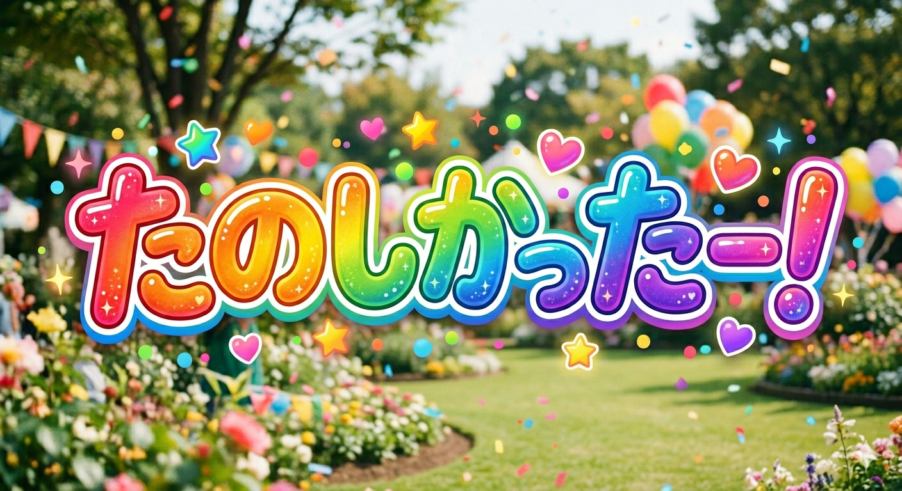

# Wakate.rb #7

2026年6月22日

---

# Wifi
### ネットワーク: 
### パスワード: 

---
# ハッシュタグ

### #wakate_rb

---

# 自己紹介

- 名前: @garebare
- 所属: 
- 業務: Rails・Next.js

---

# Wakate.rbとは？

---
# Wakate.rbとは？

### 若手のRubyist同士が繋がり、
### Rubyを盛り上げるためのコミュニティ

---

## 目的

### 「若手のRubyist同士が繋がり、
### Rubyを盛り上げる」

先輩Rubyistの方にもご参加いただき、
一緒にRubyを盛り上げたいと考えています！

---

# RubyKaigi 2026 行きました？

---

# 楽しかったですかー？

---

---

## 私はNESでRubyが動いてたのを見てGBAでRubyを動かしました

---

## そこそこ時間が経ったので色々Kaigi Effectがあったと思います

---

# 今日の内容

### LT会
### 懇親会でRubyKaigi2026振り返りつつワイワイしましょう！

---

## LT（ライトニングトーク）について

- 10分程度で自由なテーマで発表
- **RubyKaigi 2026の振り返りも大歓迎！**
- 発表未経験でもOK
- カジュアルな雰囲気で行います

---

# タイムテーブル

| 時間     | 内容                         | 
| -------- | ---------------------------- | 
| 18:30 ~  | 受付             |
| 19:00 ~  | あいさつ                  | 
| 19:15 ~  | LT会                     | 
| 20:05 ~  | 懇親会                        | 
| 21:30 ~  | 片付け、撤収                  |
| 22:00    | 完全撤収                     |

---

# Discordサーバー

### 普段はDiscordでコミュニケーションをしています
### connpass内のリンクよりご参加ください！
